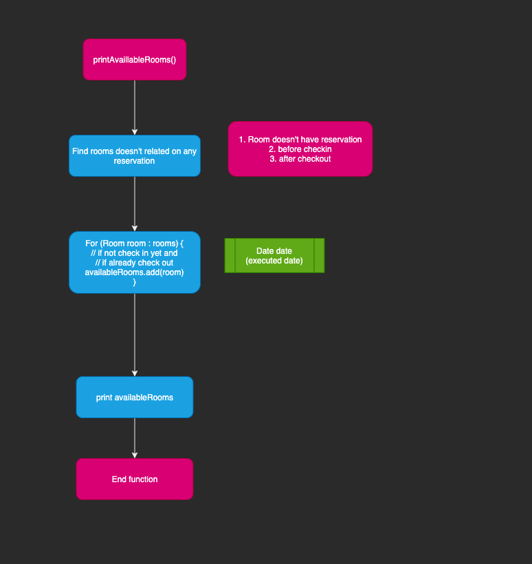

# Hotel manager
WAMD 202 Java Final project

## Overview
CLI base management system for CRUD reservation, print check-in/out.

### UML

### Application flows

### Find reservations

### Add new reservation

### Find availability

## Specification
### Entities
- Hotel has many floors
- Floor has many rooms
- Room has many reservations, but **CANNOT** has many reservation on same date.
- Floor has fixed prices by type: _F2: Single: $xx, Double: $xx..._

### Functions and Flow
- User can make a request as customer
  - Input name, check in date, stay nights, number of person
  - System recommends the price and floor
    - User can choose to accept or not
    - If user answer NO, application recommend the next cheapest room  
  - If there's no available room, system returns error message
  - If customer accept the plan, system create reservation
- User can get all reservations as manager
- User can delete the customer's information with reservation id
- User can print all reservation that check-in/out of today.

### Limitation
- Management system automatically recommend the cheapest room can provide.
- Room's price rate fixed

## Member (Alphabetical)
- Ajay
- Akari
- Wonjae
